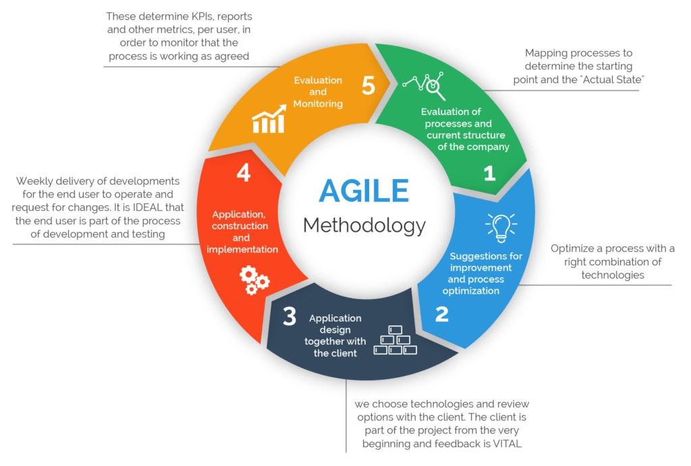

In this ICS 314 course, I have greatly improved my skills ranging from web development with react to learning databases with MongoDb. But two very important aspects of software engineering I've learned in ky opinion is Agile Project Management and Open Source Software Development.

## **What is Agile Project Management?**

Agile project management is the idea of breaking up a project into smaller more manageable milestones instead of diving head first into a project without any proper structure so that the team can work more efficiently and be able to adapt to any changes needed. This style of structure is good because it promotes collaboration with your fellow team members. If you divide a big project amongst the team and assign each subteam a task, the project will be done more quickly. This develops trust amongst your colleagues knowing that each team is responsible for each task. But it is not limited to only the team assigned. Meaning even though one team is assigned a certain task and ultimately responsible for the outcome, anyone is encouraged to help out. This can be used beyond software development. This again promotes the idea of collaboration which is very important in any field of work. Learning agile project management would be very helpful to me because I have aspirations to work game development one day.

## **What is Open Source Software Development?**

Open source software development is the process by which open source software whose source code is publicly available.

