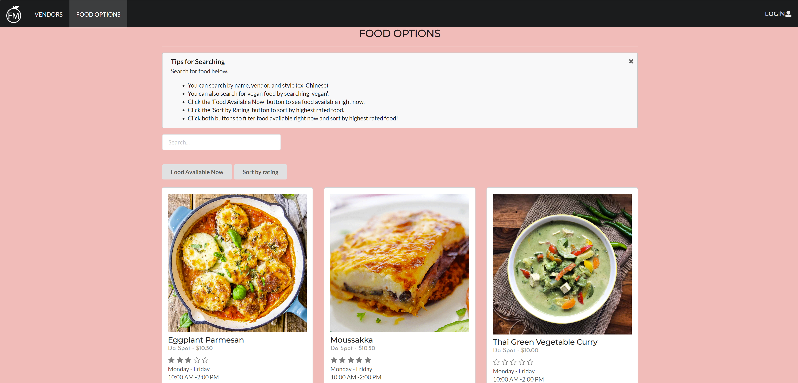
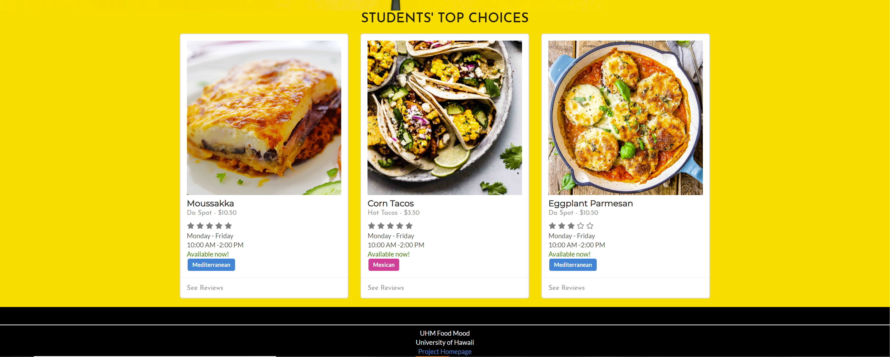

## **Initial Startup**
For our final project in ICS 314, we had to develop a web application that utilizes resources from UH Manoa and that students can use on campus. Ideas ranged from UH Manoa textbook exchange to UH Manoa carpool system. My development team and I chose the idea of UH Manoa food vendors. From there, we made the initial mockup pages of the landing page, food listings, food options, favorites, vendors, reviews, etc.

## **What is Food Mood?**

Food Mood is a interactive web application specifically produced for UH Manoa students. It features food options from vendors located on UH Manoa campus. Users can log in to view all 18 vendors with 4 food options from each totalling to 72 options. Each food option is displayed in a card where it shows the name, price, vendor, availability, ethnicity, and whether or not it's vegan. There is also a search bar where users can search for their choice and sort for ethnicity and vegan options. Users are able to view food options available at that very moment. They can also manage their favorite food choices and leave any reviews to their satisfaction.

## **My Contributions**

For this project, I mainly contributed to the food vendors page along with my team member Mike, the food options page, along with small UI updates. Kelli, which I consider the de facto leader did almost everything else including back-end work such as the databases, collections, and the overall functionality. The vendor pages consists of info from the vendor and their food options. My other main contribution was the food options page which displays all 72 food options from 18 vendors. I had to research the store hours, prices, ethnicity, vegan, and find suitable pictures for each option. The hard part of this was the prices because I had to research online or through websites like Yelp. But it didn't list any prices or old prices. So I had to come up with reasonable prices in 2019. Also for the ethnicity option, I sorted them by popularity to culture instead of origin because many foods originated from many different regions. For example, "chicken katsu" from L&L originated from Japan. But instead of labeling it Japanese, I labeled it Hawaiian instead because it is local favorite. 

Overall this project was a great learning opportunity and very enjoyable. This was somewhat of a first "real" application I contributed so it definitely helped develop my skills. The most experience I've gained from this would probably be UI skills. I've learned how to implement HTML/CSS/Javascript into web applications to make nice looking websites. I've also learned a bit about databases using MongoDB and agile project management.

You can view the GitHub homepage <a href="https://uhm-food-mood.github.io">here</a> and the Food-Mood source code <a href="https://github.com/uhm-food-mood/uhm-food-mood">here</a>.