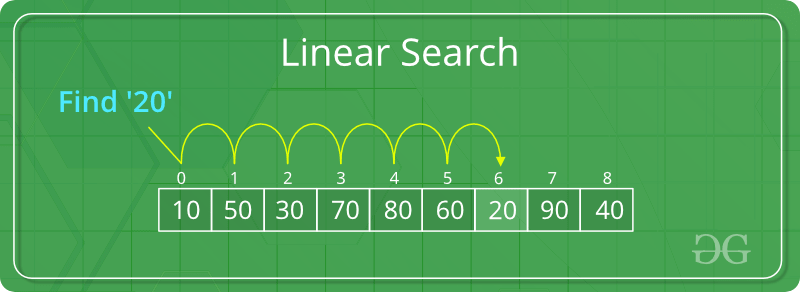

In my ICS 211 class, which is a continuation of topics from ICS 111, we had to do a final project on all the lessons learned. This included lessons from sorting and searching integers in an array, loops, functions, etc. 

## The Program
The program first begins by asking the user to begin the program by selecting "yes" or "no" option. If the user selects "no", the program terminates. If the user selects "yes", the program begins. It then creates a random array of 20 integers from 1-1000 and stores them in a new file. It then goes into a while loop with the options:

1) Display the list
2) Sort the list
3) Search for a number
4) Save the list to an external file
5) Quit the program

If you choose option 1, it displays the unsorted array. If you choose option 2, it sorts the array and displays it. If you choose option 3, it searches for a number in the array using linear search. If the number is found, then it displays a statement that the number exists. If the number is not found, it displays statement that it is not in the list. If you choose option 4, it saves the array to an external file on notepad. And finally if you choose option 5, it terminates the program.

In the two intro courses ICS 111 and ICS 211, I've learned a lot about java language and programming in general. It was fun to make an interactive program and hope to improve my skills in Java in the near future.

You can find the source code <a href="https://github.com/Wonbk/ICS-211-final-project/blob/master/FinalProject1.java">here.