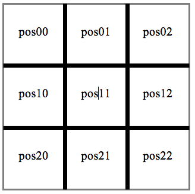

Tic Tac Toe is classic game played with paper and pencil on a 3 by 3 grid. The game is played by two players. Each player takes turns placing their marks on the grid until either player has three of their marks in a row either horizontally, vertically, or diagonally in which the winner is decided.

